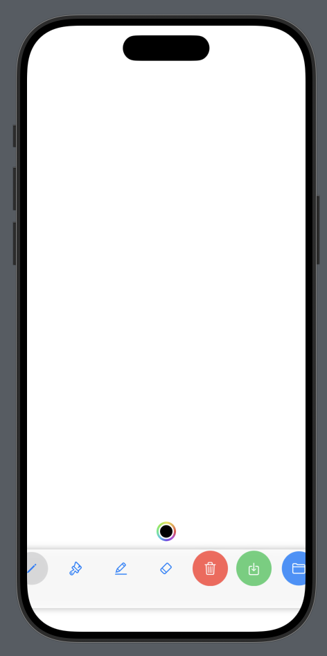

# DrawingApp- iOS
This is a drawing app for iPhones and iPads written in Swift programming language. 

It has some basic functionalities like-
- Color picker- Choose a color you like to paint with
- Pencil-  Select pencil to draw with in the picked color
- Paint brush- Select paint brush to paint in little thicker lines
- Highlighter- Select it for even thicker lines
- Eraser- to erase part of drawing select it and move over parts to remove
- Delete- Press it to clear the canvas
- Save- Use it to save your drawing
- Upload- This is to reuse your drawing which you saved earlier

  

    
  

  

    
